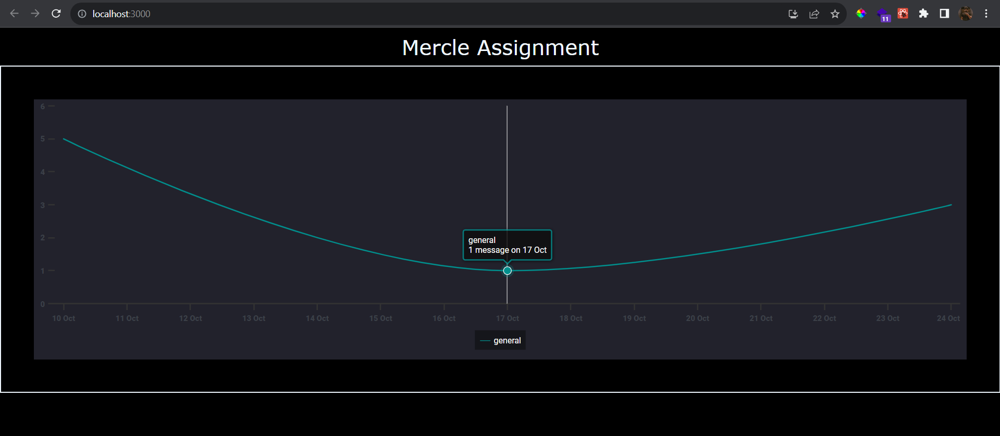

### Mercle Frontend Assignment

#### Steps to run:

- `git clone https://github.com/Sudhakar7J/mercle-assignment`
- open terminal and run `npm install` to install the node-modules.
- run the project using `npm run start` and it will redirect you to `http://localhost:3000`

### Screenshots of the app

